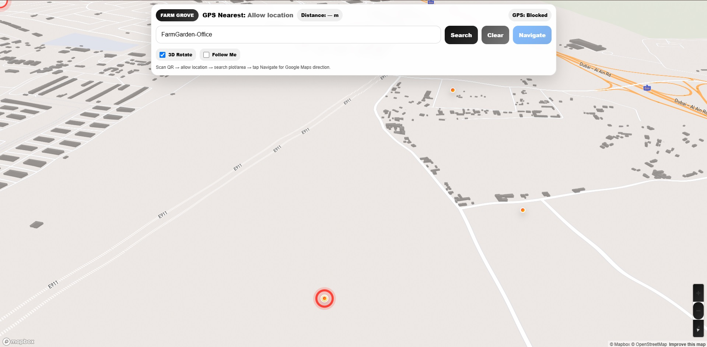
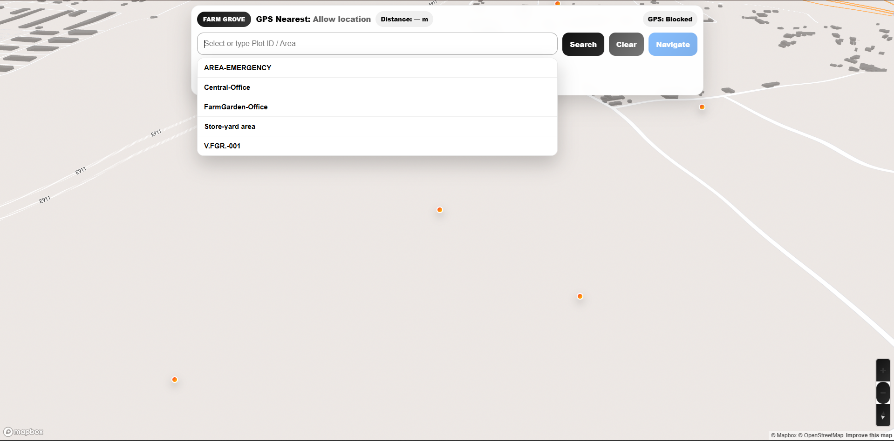

# Construction Plot Navigator

### Location-Based Navigation System for Construction Projects

**A web-based navigation solution designed to help construction teams locate plots and navigate between project locations using Google Maps integration.**

🌐 **Live Application:** https://navi.apptoryx.com/

**Project Type:** Web Application  
**Domain:** Construction Technology (ConTech)  
**Category:** Geolocation & Navigation  
**Status:** Hosted Application

---

## Project Overview

Construction Plot Navigator is a location-based web application developed to simplify plot identification and navigation within construction developments.

Large construction projects may contain numerous plots, making it difficult for project personnel, site engineers, supervisors, and visitors to locate specific destinations.

This application provides a digital approach to finding construction plots and navigating between locations through Google Maps integration.

## Core Functionality

### Plot Location Identification
- Supports locating construction plots within a project development.
- Helps users identify their intended destination.

### Plot-to-Plot Navigation
- Supports navigation between construction plot locations.
- Uses Google Maps integration for navigation.

### Construction Site Accessibility
- Provides a practical navigation solution for construction environments.
- Helps users find project locations without relying entirely on manual directions.

## Google Maps Integration

Google Maps is integrated into the navigation workflow to support location-based navigation between construction plots.

## Practical Use Cases

- Site engineers locating assigned plots
- Supervisors navigating between work locations
- Project teams visiting different construction areas
- Authorized visitors finding designated plot locations

## Technology Stack

**Confirmed integration:** Google Maps

Additional frontend, backend, and database technologies will be documented after verifying the actual implementation.

## Application Screenshots

## Application Screenshots

The following screenshots demonstrate the Construction Plot
Navigator web application and its navigation interface.

### Application Interface

### Navigation Interface

---

## Live Application

🌐 **Try the application:**
https://navi.apptoryx.com/

## Skills Demonstrated

- Web application development
- Geolocation-based application design
- Google Maps integration
- Construction workflow problem-solving
- User-focused navigation interfaces

## Live Demonstration

**Visit:** https://navi.apptoryx.com/

Availability of navigation features may depend on location permissions, supported devices, and application access settings.

## Source Code Availability

This is a public project showcase repository.

The application's proprietary source code, API keys, configuration files, and internal application data are not published.

---

**Developed by Saraswathi Poornachandran**

[GitHub Profile](https://github.com/saraswathipoornachandran) | [Developer Portfolio](https://portfolio.apptoryx.com/)
